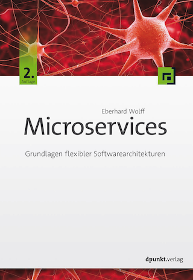

Microservices
---

 

Microservices unterteilen Software-Systeme in eine Vielzahl von
kleinen Diensten. Das verbessert Wartbarkeit und Skalierbarkeit,
verspricht eine nachhaltige Entwicklung, eine einfache
Integration in Legacy-Systeme und auch Continuous Delivery wird
so einfacher. Microservices führen aber auch zu einer höheren
Komplexität und Herausforderungen beim Deployment.

## Das Buch

Das Buch enthält eine umfangreiche Einführung in Microservices
und betrachtet Technologien genauso wie Architektur und
organisatorische Auswirkungen. Außerdem erläutert es
Nanoservices als noch kleinere Services.

## Was Leser sagen

Das beste Buch über Microservices ist IT-untypischerweise auf Deutsch:
      "Microservices" von @ewolff

[Matthias Fritschi](https://twitter.com/matfsw/status/671222544729579520)

Für IT Themen bevorzuge ich eigentlich englische Literatur, aber
Continuous Delivery und Microservices von @ewolff kann ich nur
empfehlen.

[Peter Storch](https://twitter.com/storchp/status/678547218119401473)

      
## Leseproben

Hier gibt es einige Leseproben als PDF:
      
* [1 Inhaltsverzeichnis](Buch_1_Inhaltsverzeichnis.pdf)
* [2 Vorwort](Buch_2_Vorwort.pdf)
* [3 Einleitung](Buch_3_Einleitung.pdf)
* [4 Was sind Microservices (Kapitelauszug)](Buch_4_Was_sind_Microservices(Kapitelauszug).pdf)

      
## English Translation

There is an English translation available at
      <http://microservices-book.com/> .

## Autor

Eberhard Wolff arbeitet seit mehr als fünfzehn Jahren als Architekt
und Berater – oft an der Schnittstelle zwischen Business und
Technologie. Er ist Fellow bei innoQ und Java Champion. Als Autor hat
er über hundert Artikel und Bücher geschrieben und als Sprecher auf
internationalen Konferenzen vorgetragen. Sein technologischer
Schwerpunkt liegt auf modernen Architekturansätzen – Cloud, Continuous
Delivery, DevOps, Microservices oder NoSQL spielen oft eine Rolle.
